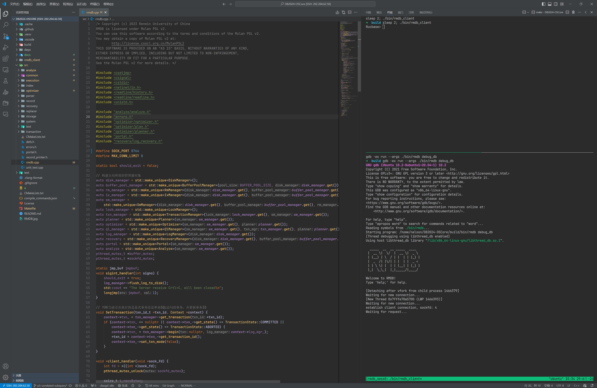
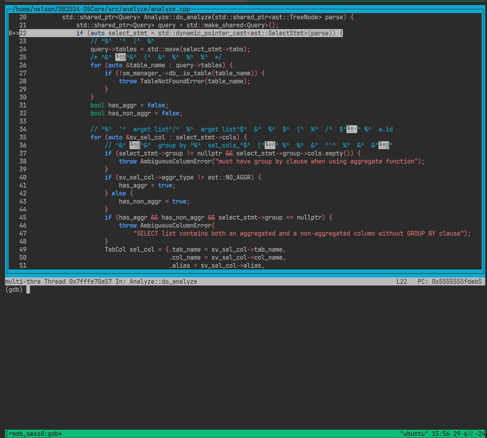

# Debug

首先请确保 `tmux` 已经安装。

使用以下指令来启动 GDB 进行调试：

```bash
make debug
``` 

Makefile 会启动 tmux，将其上下分为两个窗格，然后按顺序启动 rmdb 和 rmdb_client，如下图所示：



同时建议使用以上布局来进行 debug。

使用快捷键 `<Ctrl + b> + ↓` 和 `<Ctrl + b> + ↑` 在两个窗格之间切换。

刚进入 GDB 的时候，rmdb 会处于等待 client 发送指令的状态，需要使用快捷键 `<Ctrl + c>` 来暂停运行，才能输入 GDB 相关的指令。

在 GDB 中输入指令 `layout src` 可以进入 GDB 的 tui 模式，以实时显示源代码：



使用指令 `<Ctrl + b> + &` 然后输入 `y` 来关闭窗口，退出 debug。

与 tmux 有关的指令可以参考：[Tmux 使用教程 - 阮一峰的网络日志](https://www.ruanyifeng.com/blog/2019/10/tmux.html)。
